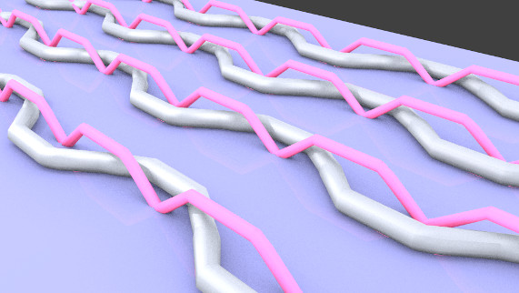

#Modelling and visualisation of stitches for the Penelope Project

A language and modelling system for textiles, taking a "thread" centric 
perspective. Designed to be driven by Alex McLean's higher level thread
language.

Code takes the form of comma separated lists of instructions.

Instructions:

- over: jump over a thread
- under: dive under a thread
- pull X: stretch X steps forward
- turn in: turn 90 degrees in current direction
- turn out: turn 90 degrees in current direction and flip current direction
- twist: rotate 90 degrees in thread axis

##How it works

These instructions are read by a procedural rendering system: a lisp compiler 
and bytecode interpreter for 3D geometry called Jellyfish. This system is 
based on Fluxus, and designed for low power computing, e.g. Raspberry Pi or 
mobile.

The resulting thread geometry can be viewed in real time or exported for 
offline rendering with Blender.
